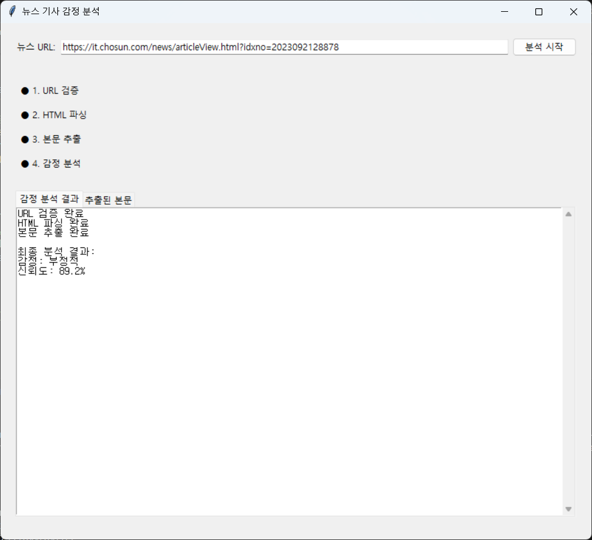
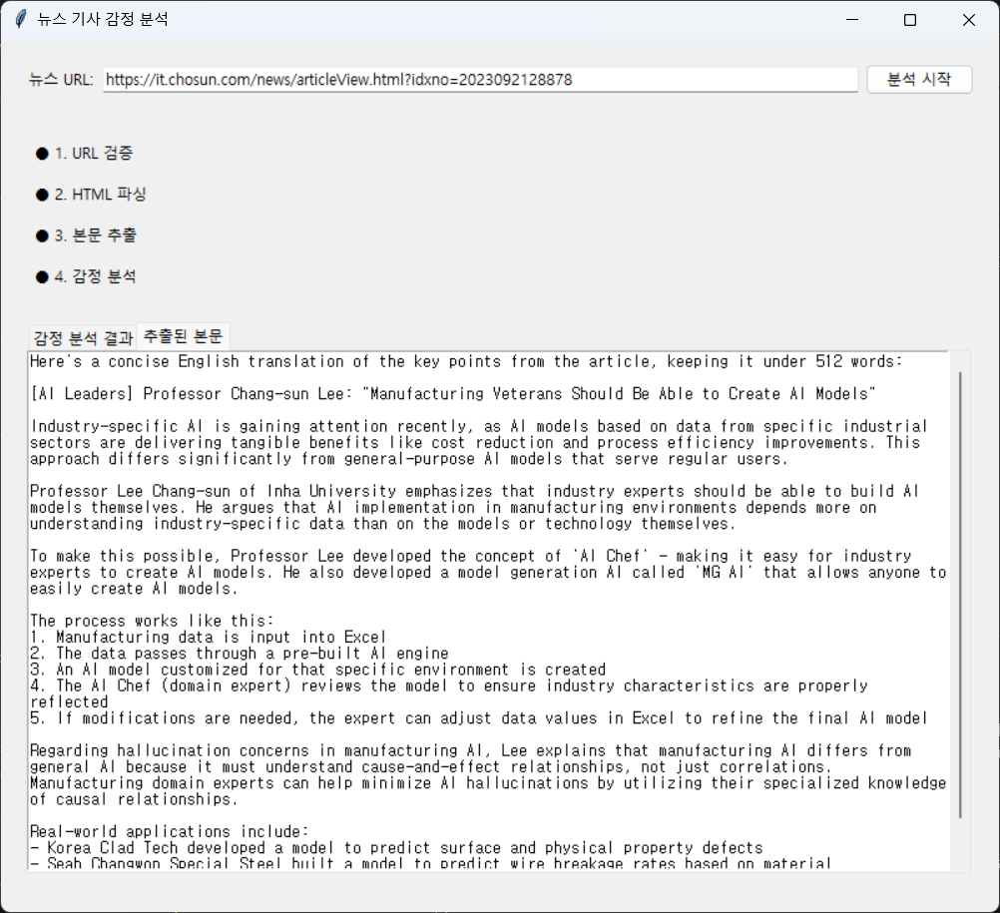

# KANGMINJAE's project
### Article Sentiment Analyzer

This project provides a sophisticated tool for analyzing the sentiment of news articles. By simply inputting a **URL**, users can extract article content and determine whether the overall tone is positive or negative, all through an intuitive graphical interface.

## Project Overview

Our application streamlines the process of news article analysis by offering these key features:

1. URL validation and processing
2. Automated main content parsing
3. Advanced content extraction using Large Language Models
4. Sentiment analysis of the extracted text
5. Real-time progress monitoring
6. Visual representation of analysis results

## Demonstration




## Required Packages

The project relies on several Python packages. Install them using:

```bash
pip install -r requirements.txt
```

Key dependencies include:
```
anthropic==0.7.0
transformers==4.36.2
tkinter    # Built into Python
requests==2.31.0
beautifulsoup4==4.12.3
```

## Installation and Setup

1. Environment Configuration
   ```bash
   # Install dependencies
   pip install -r requirements.txt
   ```

2. API Configuration
   ```bash
   # Set Anthropic API key
   ANTHROPIC_API_KEY='your-api-key'  # For Windows: set ANTHROPIC_API_KEY=your-api-key
   ```

3. Launch Application
   ```bash
   python ui.py
   ```

## Usage Instructions

1. Launch the application and paste a news article URL into the input field
2. Click the "Start Analysis" button
3. Monitor the real-time progress indicators
4. Review the extracted content and sentiment analysis results in their respective tabs

## Reference Documentation

1. API and Library Documentation
   - [Anthropic Claude API Documentation](https://docs.anthropic.com/)
   - [Transformers Library Documentation](https://huggingface.co/transformers/)
   - [Beautiful Soup Documentation](https://www.crummy.com/software/BeautifulSoup/bs4/doc/)
   - [Tkinter Documentation](https://docs.python.org/3/library/tkinter.html)

2. Article URLs
   - [sample1](https://n.news.naver.com/mnews/article/057/0001857665)
   - [sample2](https://it.chosun.com/news/articleView.html?idxno=2023092128878)
